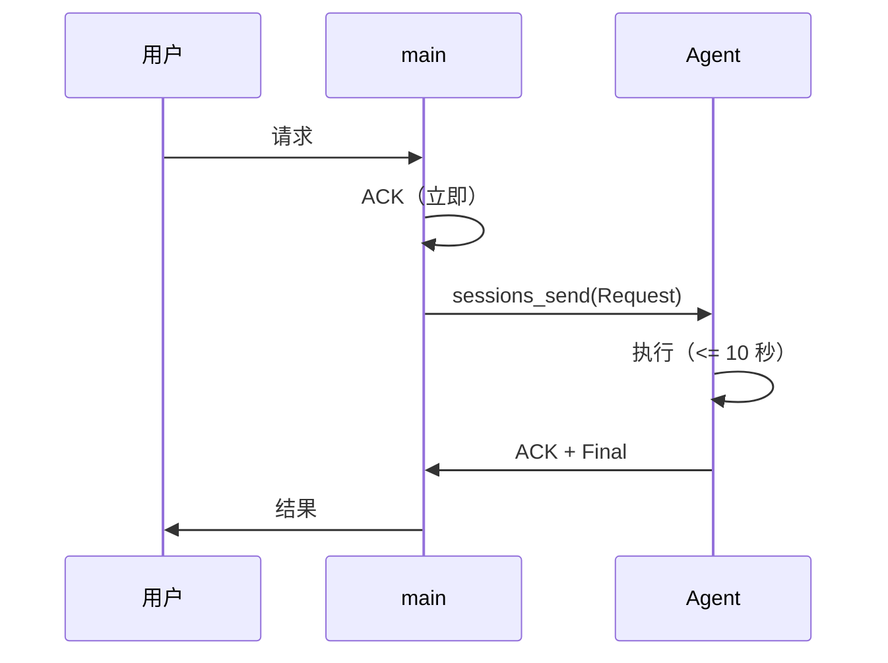
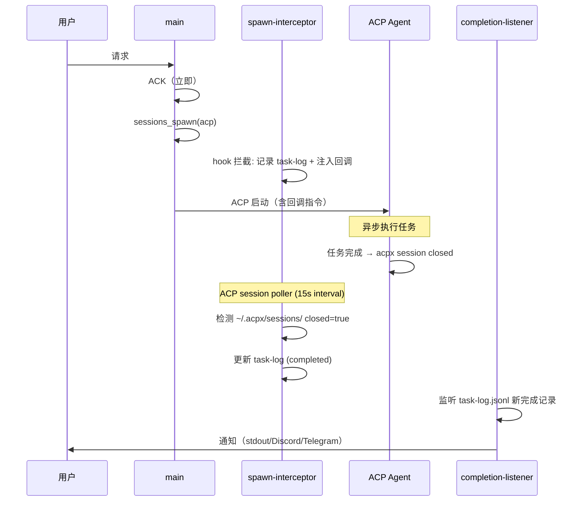
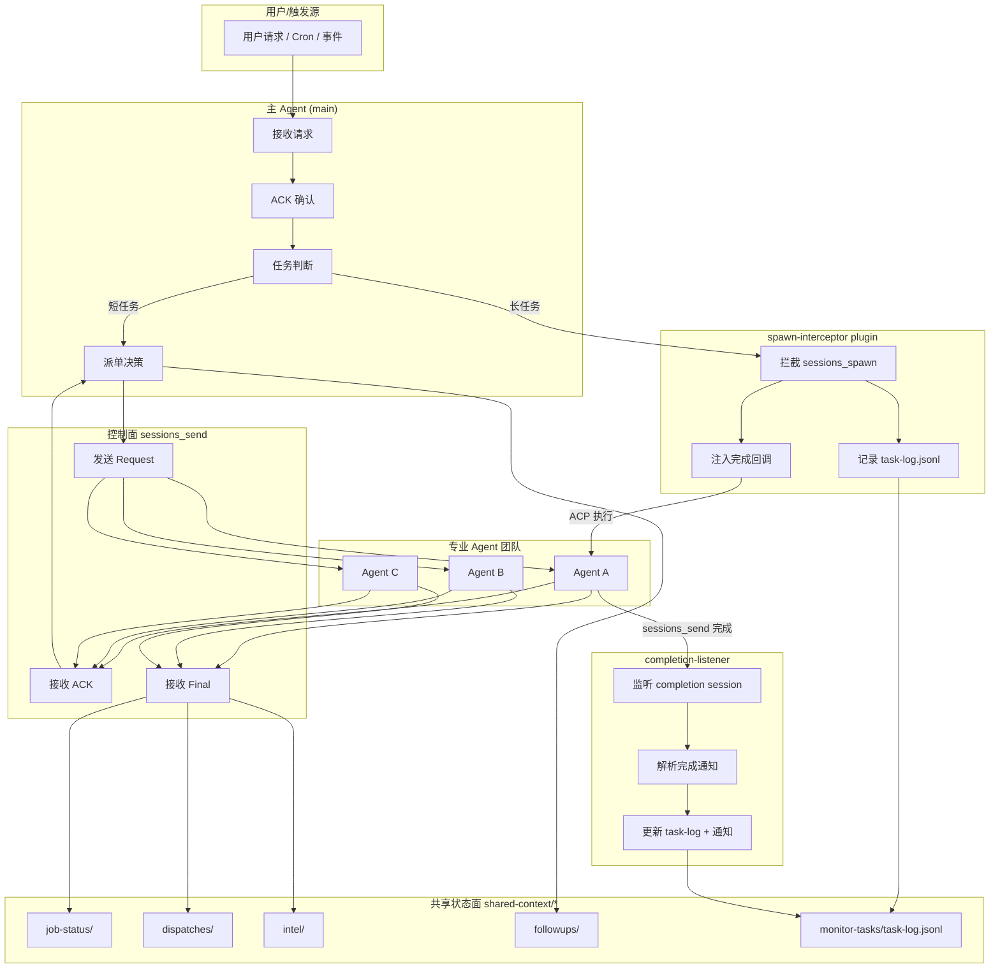
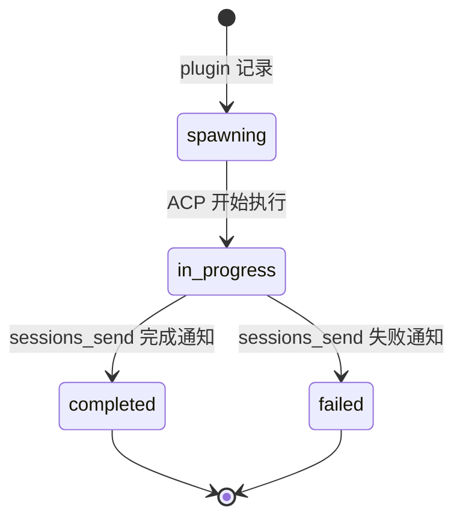
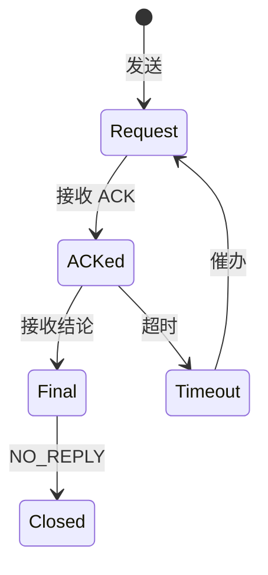

# OpenClaw 多 Agent 协作框架 — 架构说明

<!-- 阅读顺序: 4/5 -->
<!-- 前置: AGENT_PROTOCOL.md -->
<!-- 后续: TEMPLATES.md -->

> Version: 2026-03-13-v3

---

## 概述

本框架为 OpenClaw 多 Agent 团队提供统一的协作协议和架构模式，支持：
- 异步任务执行与状态追踪
- 跨 Agent 控制面通信
- 共享状态管理
- 每日反思与次日落地闭环

---

## 核心架构组件

### 1. 控制面 (Control Plane)

**职责**：任务派发、ACK 确认、简短结论、正式控制面消息

**工具**：`sessions_send`

**特点**：
- 同步或短异步（<= 10 秒）
- 用于 Agent 间直接通信
- 必须带 ack_id 进行追踪

### 2. 异步回执面 (Async Receipt Plane)

**职责**：长任务执行、状态变化通知、终态回推

**工具**：`spawn-interceptor` plugin + `completion-listener`

**特点**：
- 适用于 >10 秒的长任务
- `spawn-interceptor` 自动拦截 `sessions_spawn` 并记录到 task-log（v2.4: 含 ACP session poller + 原子持久化）
- ACP 任务自动注入完成回调，完成时通过 `sessions_send` 回推结果
- `completion-listener` 处理通知并更新 task-log 状态

### 3. 共享状态面 (Shared State Plane)

**职责**：协议、任务真值、中间状态、follow-up、intel 存储

**路径**：`shared-context/*`

**关键目录**：
```
shared-context/
├── AGENT_PROTOCOL.md      # 统一协作协议（唯一真值）
├── job-status/            # 任务状态追踪
├── monitor-tasks/         # task-log.jsonl（plugin 自动写入）
├── dispatches/            # 派单记录
├── intel/                 # 跨 Agent 情报共享
├── followups/             # 每日反思落地追踪
└── archive/               # 历史文档归档
```

---

## 数据流架构

### 短任务流程（<= 10 秒）



### 长任务流程（> 10 秒）— 拦截 + 回调架构



### 数据流总览



---

## 通信层架构：拦截 + 回调

> 详见 [COMMUNICATION_ISSUES.md](COMMUNICATION_ISSUES.md) 完整设计文档

### 解决的核心问题

| 问题 | 根因 | 解决方案 |
|------|------|----------|
| ACP 完成不通知 | OpenClaw Bug #40272 | prompt 注入完成回调 |
| timeout 语义模糊 | `sessions_send` 只有 ok/timeout | task-log 确定性追踪 |
| Agent 忘记注册监控 | LLM 肌肉记忆 | `before_tool_call` hook 自动拦截 |

### 架构决策

**为什么不用文件轮询**：
- 行业共识：轮询用于编排是反模式
- 延迟高（最坏 5 分钟）
- 代码量大（旧方案 ~2,543 行 (v1.1.0, 含 DLQ/Terminal Bridge/Guardrail) vs 新方案 ~600 行）

**为什么不用 Lobster（OpenClaw 内建 YAML 工作流引擎）**：
- Lobster 适合确定性同步流程
- 我们需要异步完成通知 + 灵活的 LLM 编排
- 可共存：确定性流程用 Lobster，异步任务用 plugin

**为什么不用主流编排框架（LangGraph/CrewAI/AutoGen）**：
- OpenClaw 是 Agent Runtime（非 Python 编排框架）
- 引入外部框架会破坏 OpenClaw 的 session 管理
- plugin 机制是 OpenClaw 原生的扩展方式

### 实现位置

| 组件 | 路径 | 语言 | 行数 |
|------|------|------|------|
| spawn-interceptor | `plugins/spawn-interceptor/` | Node.js | ~150 |
| completion-listener | `examples/completion-relay/` | Python | ~200 |
| 设计文档 | `COMMUNICATION_ISSUES.md` | — | — |

### 代码量对比

| 维度 | 旧方案 (task-callback-bus) | 新方案 |
|------|---------------------------|--------|
| 核心代码 | ~2,543 行 (v1.1.0, 含 DLQ/Terminal Bridge/Guardrail) Python | ~600 行 (JS + Python) |
| 轮询频率 | 每 5 分钟 | 无轮询（事件驱动） |
| 注册方式 | Agent 手动 / wrapper | 自动（plugin hook） |
| 通知延迟 | 最坏 5 分钟 | < 1 分钟 |

---

## 状态机设计

### 任务状态机



### 控制面消息状态



---

## 关键设计模式

### 1. ACK 守门模式

**问题**：Agent 忙于后台处理而忽略即时响应，导致用户/其他 Agent 不确定任务是否收到。

**方案**：
- 强制先 ACK 再处理
- ACK 必须在当前回合完成
- 禁止以"正在查"为由延迟 ACK

### 2. 单写入者模式

**问题**：多线并行时状态冲突，旧线程继续写入导致混乱。

**方案**：
- 每个任务只有一个合法 owner
- 重开/替代时旧线程必须停写
- 新 owner 必须落文件声明所有权

### 3. 真值落盘模式

**问题**：关键状态只存在于聊天历史，无法追溯和审计。

**方案**：
- 关键事实必须写入 shared-context/
- 验收时优先检查文件产物
- 聊天回执仅作为辅助参考

### 4. 自动拦截模式（v2 新增）

**问题**：Agent 总是忘记手动注册监控。

**方案**：
- 用 `before_tool_call` hook 自动拦截 `sessions_spawn`
- Agent 继续使用原生工具，无需记住额外步骤
- 系统层保障 > 文档约束

### 5. 反思落地闭环模式

**问题**：每日反思流于形式，次日无实际动作。

**方案**：
- 反思必须产出 followups/YYYY-MM-DD.md
- 次日 09:30 前必须转成实际动作
- 无 owner/无证据路径的事项不算落实

---

## 扩展性设计

### 新增 Agent

1. 在团队配置中注册新 Agent
2. 分配职责边界
3. 配置 sessions_send 路由
4. 培训协议规范

### 新增任务类型

1. 定义任务触发条件
2. 确定执行阈值（同步/异步）
3. plugin 自动追踪（无需额外配置）

### 集成外部系统

1. 通过 MCP 服务器接入
2. 封装为 skill
3. 遵循异步执行规范
4. 状态落 shared-context/

---

## 安全与边界

### 权限控制
- Agent 只能访问授权目录
- 敏感操作需要用户确认
- 线上变更遵循预检流程

### 数据隔离
- 各 Agent 工作区隔离
- 共享状态通过 shared-context/
- 密钥不进入共享区

### 审计追踪
- 所有 ACP 任务自动记录到 task-log.jsonl
- 控制面消息有 ack_id 追踪
- 完成通知有时间戳和状态

---

## 性能优化

### 并发控制
- 多线并行时显式区分主线/支线
- 避免重复执行相同任务
- 使用缓存减少重复调用

### 资源管理
- 长任务后台执行
- 大文件分块处理
- 网络请求批量执行

### 响应优化
- ACK 优先，结果后补
- 事件驱动通知（< 1 分钟延迟）
- 超时自动降级

---

## 故障恢复

### 任务失败
1. completion-listener 记录失败到 task-log
2. 通知相关方
3. 决定重试/降级/放弃

### Agent 离线
1. 检测超时
2. 切换到备用 Agent
3. 记录状态变更

### Plugin 异常
1. Gateway 日志检查 `spawn-interceptor` 错误
2. 降级：手动追踪任务
3. 修复后 `launchctl kickstart` 重启 Gateway

---

## 版本管理

- 协议版本：`YYYY-MM-DD-vN`
- 重大变更升级主版本
- 小改进升级次版本
- 历史版本归档到 archive/

---

## 统一监控: task-log.jsonl

v2.3+ 引入了统一的 `task-log.jsonl` 作为所有任务事件的单一事实源。

### 写入方

| 来源 | runtime 值 | completionSource |
|------|-----------|------------------|
| spawn-interceptor (L1: subagent_ended) | `subagent` | `subagent_ended_hook` |
| spawn-interceptor (L2: ACP session poller) | `acp` | `acp_session_poller` |
| spawn-interceptor (L3: stale reaper) | 任意 | `stale_reaper` |
| task-callback-bus WatcherBus (状态变化) | `external` | `watcher_state_change` |
| task-callback-bus WatcherBus (任务关闭) | `external` | `watcher_close` |

### 读取方

- `completion-listener`：增量读取 `task-log.jsonl`，通过 `.relay-cursor-v2` 记录进度
- 任意外部脚本：按 JSONL 格式逐行解析

### 格式

每行一个 JSON 对象，必含字段：`taskId`, `status`, `completionSource`。其余字段按来源补充。
