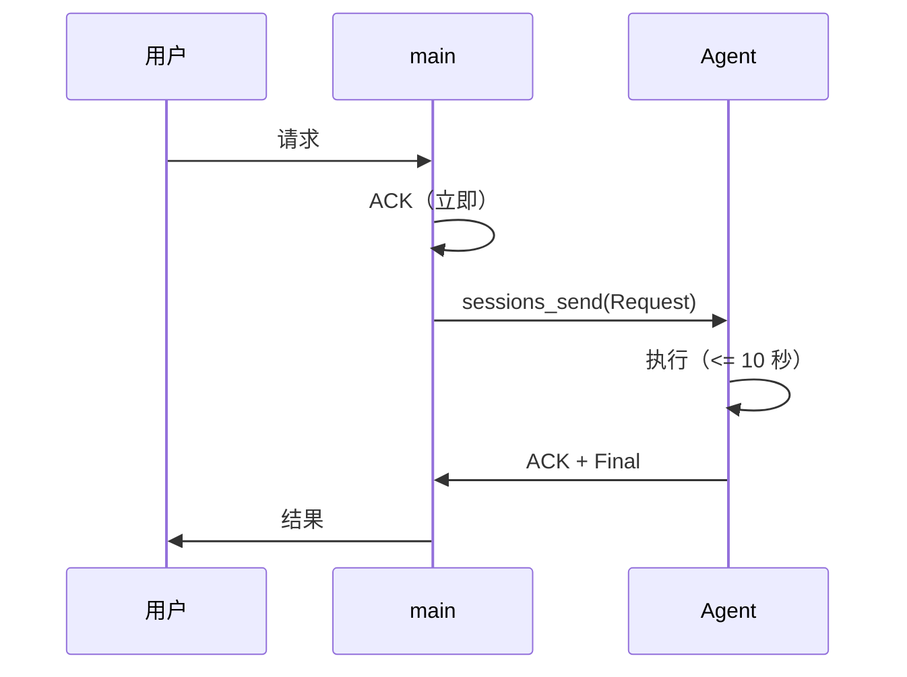
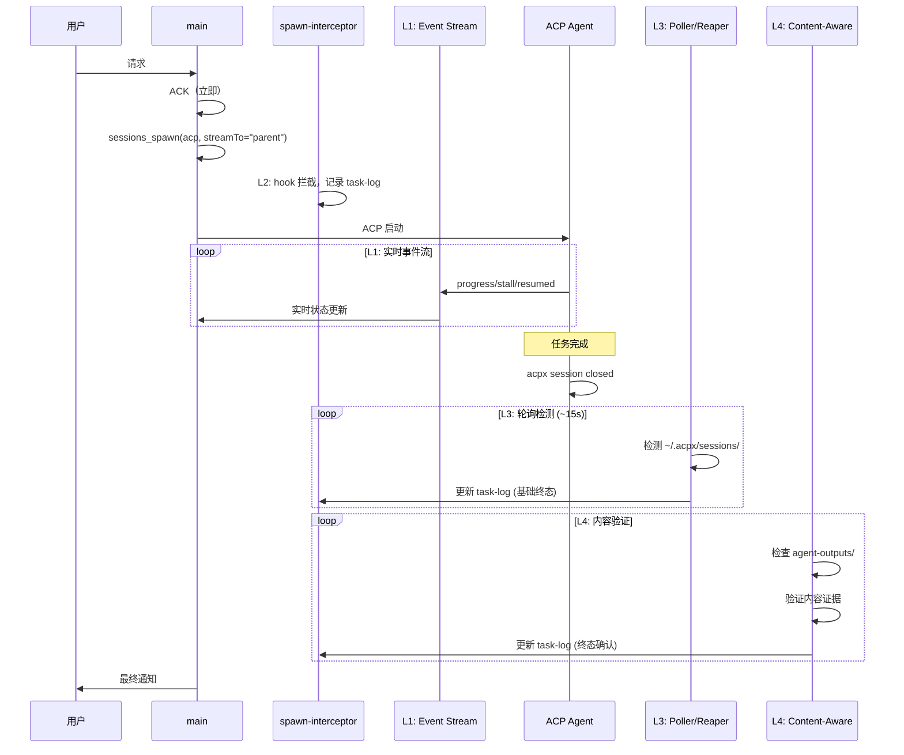
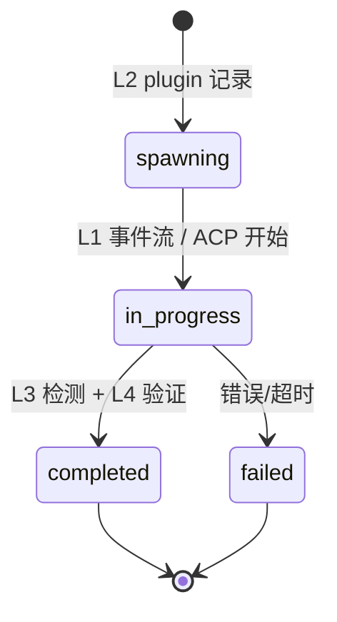
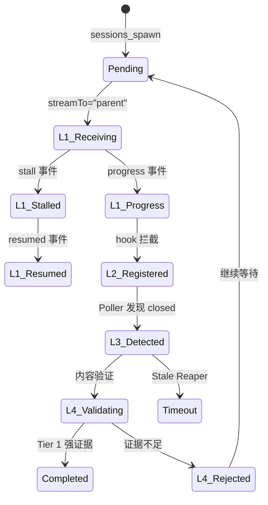

# OpenClaw 多 Agent 协作框架 — 架构说明

<!-- 阅读顺序: 4/5 -->
<!-- 前置: AGENT_PROTOCOL.md -->
<!-- 后续: TEMPLATES.md -->

> Version: 2026-03-13-v4

---

## 概述

本框架为 OpenClaw 多 Agent 团队提供统一的协作协议和架构模式，支持：
- 异步任务执行与状态追踪
- 跨 Agent 控制面通信
- 共享状态管理
- 每日反思与次日落地闭环

---

## 核心架构组件

### 1. 控制面 (Control Plane)

**职责**：任务派发、ACK 确认、简短结论、正式控制面消息

**工具**：`sessions_send`

**特点**：
- 同步或短异步（<= 10 秒）
- 用于 Agent 间直接通信
- 必须带 ack_id 进行追踪

### 2. 异步回执面 (Async Receipt Plane)

**职责**：长任务执行、状态变化通知、终态回推

**工具**：四层完成检测链路

**四层架构**：

| 层 | 组件 | 职责 | 覆盖场景 |
|----|------|------|----------|
| L1 | 原生事件流 | `streamTo="parent"` 实时状态 | ACP runtime |
| L2 | spawn-interceptor | Hook 拦截、任务登记 | 所有 sessions_spawn |
| L3 | Poller + Reaper | 基础终态检测 | 会话关闭、超时 |
| L4 | content-aware-completer | 内容证据验证 | Type 4 任务纠偏 |

### 3. 共享状态面 (Shared State Plane)

**职责**：协议、任务真值、中间状态、follow-up、intel 存储

**路径**：`shared-context/*`

**关键目录**：
```
shared-context/
├── AGENT_PROTOCOL.md      # 统一协作协议（唯一真值）
├── job-status/            # 任务状态追踪
├── monitor-tasks/         # task-log.jsonl（plugin 自动写入）
├── agent-outputs/         # Agent 输出产物（L4 证据来源）
├── dispatches/            # 派单记录
├── intel/                 # 跨 Agent 情报共享
├── followups/             # 每日反思落地追踪
└── archive/               # 历史文档归档
```

---

## 四层完成检测架构详解

### Layer 1: 原生事件流 (OpenClaw Native)

**实现**：`sessions_spawn(streamTo="parent")`

**能力**：
- 接收 progress、stall、resumed 事件
- 实时状态更新
- 无需额外组件

**Agent 使用**：
```python
sessions_spawn(
    sessionKey="agent:worker:task",
    agentId="worker",
    prompt="Task description",
    mode="run",  # 推荐默认值
    streamTo="parent",  # 启用 L1 事件流
)
```

### Layer 2: 启动登记层 (spawn-interceptor)

**实现**：`plugins/spawn-interceptor/index.js`

**职责**：
- 拦截所有 `sessions_spawn` 调用
- 记录到 `task-log.jsonl`（spawning 状态）
- **重要**：只负责启动登记，不是完成真值

**Hook 职责澄清**：
- Hook 记录任务启动（spawning）
- Hook 不检测任务完成
- 完成检测由 L3/L4 负责

### Layer 3: 基础终态层 (Poller + Reaper)

**实现**：`plugins/spawn-interceptor/index.js` (poller + reaper)

**组件**：

| 组件 | 触发条件 | 职责 |
|------|----------|------|
| ACP Session Poller | 每 15 秒 | 轮询 `~/.acpx/sessions/` |
| Stale Reaper | 30 分钟 | 标记超时任务 |

**限制**：
- 仅检测会话状态（closed/open）
- 不验证内容证据
- 可能产生"假完成"（Type 4 任务）

### Layer 4: 终态纠偏层 (content-aware-completer)

**实现**：`examples/content-aware-completer/content_aware_completer.py`

**解决的问题**：Type 4 任务（Registered=False, Terminal=False）

**四层决策规则**：

```
┌─────────────────────────────────────────────────────────────┐
│                    四层决策矩阵                              │
├─────────────────────────────────────────────────────────────┤
│                                                             │
│  Tier 1: 强证据（高置信度）                                 │
│  • Session closed = true                                    │
│  • Content evidence present                                 │
│  → Action: Mark completed                                   │
│                                                             │
│  Tier 2: 有状态无内容（中置信度）                           │
│  • Session closed = true                                    │
│  • No valid content                                         │
│  → Action: Keep pending (possible false terminal)          │
│                                                             │
│  Tier 3: 有内容无状态（低置信度）                           │
│  • Content present                                          │
│  • Session not closed                                       │
│  → Action: Keep pending (still running)                    │
│                                                             │
│  Tier 4: 无证据（低置信度）                                 │
│  • No session state                                         │
│  • No content                                               │
│  → Action: Keep pending                                     │
│                                                             │
└─────────────────────────────────────────────────────────────┘
```

**核心规则**：
- **历史文件拒绝**：文件创建时间早于任务 5 分钟以上 → 拒绝
- **空文件拒绝**：文件大小 < MIN_CONTENT_SIZE (10 bytes) → 拒绝
- **幂等写入**：同一任务多次处理不产生重复日志
- **UTC 时区安全**：所有时间戳使用 UTC

---

## 数据流架构

### 短任务流程（<= 10 秒）



### 长任务流程（> 10 秒）— 四层链路架构



### 数据流总览

```mermaid
flowchart TB
    subgraph User["用户/触发源"]
        U[用户请求 / Cron / 事件]
    end

    subgraph Main["主 Agent (main)"]
        M1[接收请求]
        M2[ACK 确认]
        M3[任务判断]
        M4[派单决策]
    end

    subgraph Control["控制面 sessions_send"]
        C1[发送 Request]
        C2[接收 ACK]
        C3[接收 Final]
    end

    subgraph Agents["专业 Agent 团队"]
        A1[Agent A]
        A2[Agent B]
        A3[Agent C]
    end

    subgraph L1["L1: 原生事件流"]
        L1_1[streamTo="parent"]
        L1_2[progress/stall/resumed]
    end

    subgraph L2["L2: 启动登记层"]
        L2_1[spawn-interceptor]
        L2_2[记录 task-log.jsonl]
        L2_3[pendingTasks Map]
    end

    subgraph L3["L3: 基础终态层"]
        L3_1[ACP Session Poller]
        L3_2[Stale Reaper]
    end

    subgraph L4["L4: 终态纠偏层"]
        L4_1[content-aware-completer]
        L4_2[内容证据分析]
        L4_3[四层决策]
    end

    subgraph State["共享状态面 shared-context/*"]
        S1[job-status/]
        S2[dispatches/]
        S3[intel/]
        S4[followups/]
        S5[task-log.jsonl]
        S6[agent-outputs/]
    end

    U --> M1
    M1 --> M2
    M2 --> M3
    M3 -->|短任务| M4
    M3 -->|长任务| L2_1

    M4 --> C1
    C1 --> A1 & A2 & A3
    A1 & A2 & A3 --> C2
    C2 --> M4
    A1 & A2 & A3 --> C3

    L2_1 --> L2_2
    L2_2 --> S5
    L2_1 --> L2_3

    A1 -->|stream events| L1_1
    L1_1 --> L1_2
    L1_2 --> M4

    L3_1 -->|检测 session| L3
    L3_2 -->|timeout| L3
    L3 -->|基础终态| S5

    L4_1 -->|读取| S6
    L4_2 -->|分析| L4_3
    L4_3 -->|终态确认| S5

    C3 --> S1 & S2 & S3
    M4 --> S4
```

---

## 通信层架构：四层完成链路

> 详见 [COMMUNICATION_ISSUES.md](COMMUNICATION_ISSUES.md) 完整设计文档

### 解决的核心问题

| 问题 | 根因 | 解决方案 |
|------|------|----------|
| ACP 完成不通知 | OpenClaw Bug #40272 | 四层完成检测链路 |
| timeout 语义模糊 | `sessions_send` 只有 ok/timeout | task-log 确定性追踪 |
| Agent 忘记注册监控 | LLM 肌肉记忆 | `before_tool_call` hook 自动拦截 |
| Type 4 任务假完成 | 仅依赖会话状态 | L4 内容证据验证 |

### 架构决策

**为什么用四层架构**：
- **分层防御**：每层处理不同场景，优雅降级
- **职责分离**：L2 登记、L3 检测、L4 验证
- **避免单点故障**：多层保障确保任务不丢失

**为什么需要 L4 内容验证**：
- 会话关闭 ≠ 任务真正完成
- 需要内容证据防止假完成
- 解决历史文件、空文件问题

**为什么不用文件轮询**：
- 行业共识：轮询用于编排是反模式
- 延迟高（最坏 5 分钟）
- 代码量大（旧方案 ~2,543 行 vs 新方案 ~800 行）

### 实现位置

| 组件 | 路径 | 语言 | 行数 | 层级 |
|------|------|------|------|------|
| spawn-interceptor | `plugins/spawn-interceptor/` | Node.js | ~150 | L2 |
| completion-listener | `examples/completion-relay/` | Python | ~200 | 通知 |
| content-aware-completer | `examples/content-aware-completer/` | Python | ~400 | L4 |

### 代码量对比

| 维度 | 旧方案 (task-callback-bus) | 新方案 (v2.5) |
|------|---------------------------|--------------|
| 核心代码 | ~2,543 行 Python | ~750 行 (JS + Python) |
| 架构 | 单层重组件 | 四层轻量链路 |
| 完成验证 | 仅会话状态 | 会话 + 内容证据 |
| 通知延迟 | 最坏 5 分钟 | < 1 分钟 |

---

## 状态机设计

### 任务状态机



### 四层检测状态



---

## 关键设计模式

### 1. ACK 守门模式

**问题**：Agent 忙于后台处理而忽略即时响应，导致用户/其他 Agent 不确定任务是否收到。

**方案**：
- 强制先 ACK 再处理
- ACK 必须在当前回合完成
- 禁止以"正在查"为由延迟 ACK

### 2. 单写入者模式

**问题**：多线并行时状态冲突，旧线程继续写入导致混乱。

**方案**：
- 每个任务只有一个合法 owner
- 重开/替代时旧线程必须停写
- 新 owner 必须落文件声明所有权

### 3. 真值落盘模式

**问题**：关键状态只存在于聊天历史，无法追溯和审计。

**方案**：
- 关键事实必须写入 shared-context/
- 验收时优先检查文件产物
- 聊天回执仅作为辅助参考

### 4. 四层检测模式

**问题**：单层检测存在盲区，导致任务丢失或假完成。

**方案**：
- L1 原生事件流：实时状态
- L2 Hook 拦截：强制登记
- L3 轮询+收割：基础终态
- L4 内容验证：纠偏确认

### 5. 反思落地闭环模式

**问题**：每日反思流于形式，次日无实际动作。

**方案**：
- 反思必须产出 followups/YYYY-MM-DD.md
- 次日 09:30 前必须转成实际动作
- 无 owner/无证据路径的事项不算落实

---

## 扩展性设计

### 新增 Agent

1. 在团队配置中注册新 Agent
2. 分配职责边界
3. 配置 sessions_send 路由
4. 培训协议规范

### 新增任务类型

1. 定义任务触发条件
2. 确定执行阈值（同步/异步）
3. plugin 自动追踪（无需额外配置）
4. 如有需要，配置 L4 验证规则

### 集成外部系统

1. 通过 MCP 服务器接入
2. 封装为 skill
3. 遵循异步执行规范
4. 状态落 shared-context/

---

## 安全与边界

### 权限控制
- Agent 只能访问授权目录
- 敏感操作需要用户确认
- 线上变更遵循预检流程

### 数据隔离
- 各 Agent 工作区隔离
- 共享状态通过 shared-context/
- 密钥不进入共享区

### 审计追踪
- 所有 ACP 任务自动记录到 task-log.jsonl
- 控制面消息有 ack_id 追踪
- 完成通知有时间戳和状态
- L4 记录内容证据和置信度

---

## 性能优化

### 并发控制
- 多线并行时显式区分主线/支线
- 避免重复执行相同任务
- 使用缓存减少重复调用

### 资源管理
- 长任务后台执行
- 大文件分块处理
- 网络请求批量执行

### 响应优化
- ACK 优先，结果后补
- 事件驱动通知（< 1 分钟延迟）
- L4 增量验证，避免全量扫描

---

## 故障恢复

### 任务失败
1. L3/L4 记录失败到 task-log
2. 通知相关方
3. 决定重试/降级/放弃

### Agent 离线
1. 检测超时
2. 切换到备用 Agent
3. 记录状态变更

### Plugin 异常
1. Gateway 日志检查 `spawn-interceptor` 错误
2. 降级：手动追踪任务
3. 修复后 `launchctl kickstart` 重启 Gateway

### L4 Completer 异常
1. 检查 `agent-outputs/` 目录权限
2. 检查 task-log 格式
3. 使用 `--dry-run` 模式调试

---

## 版本管理

- 协议版本：`YYYY-MM-DD-vN`
- 重大变更升级主版本
- 小改进升级次版本
- 历史版本归档到 archive/

---

## 统一监控: task-log.jsonl

v2.5 引入了四层架构，`task-log.jsonl` 依然作为所有任务事件的单一事实源。

### 写入方

| 来源 | runtime 值 | completionSource | 层级 |
|------|-----------|------------------|------|
| spawn-interceptor (L2 登记) | `acp`/`subagent` | `spawn_interceptor` | L2 |
| ACP Session Poller (L3) | `acp` | `acp_session_poller` | L3 |
| Stale Reaper (L3) | 任意 | `stale_reaper` | L3 |
| content-aware-completer (L4) | 任意 | `content_aware_completer` | L4 |

### L4 写入格式

```json
{
  "taskId": "tsk_20260313_abc123",
  "status": "completed",
  "completionSource": "content_aware_completer",
  "completionReason": "Tier 1: Session closed + content evidence present",
  "confidence": "high",
  "evidence": {
    "hasStreamClosed": true,
    "hasContentOutput": true,
    "contentSize": 1024,
    "completionKeywordsFound": ["completed", "finished"],
    "outputFiles": ["agent-outputs/tsk_abc123/output.md"]
  },
  "completedAt": "2026-03-13T01:32:15.000Z",
  "updatedAt": "2026-03-13T01:32:15.000Z"
}
```

### 读取方

- `completion-listener`：增量读取 `task-log.jsonl`
- `content-aware-completer`：读取 pending 任务，写入 completion
- 任意外部脚本：按 JSONL 格式逐行解析
