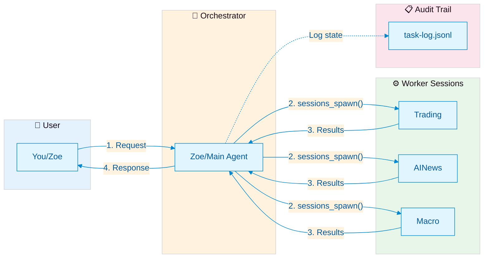

# OpenClaw Multi-Agent Collaboration Framework

> A battle-tested multi-agent collaboration protocol and architecture for OpenClaw. Solves unreliable ACP communication, agent task-registration amnesia, and ambiguous timeout semantics with a zero-config plugin system.

[中文版 (Chinese README)](README_CN.md)

**Version**: 2026-03-13-v9 | **License**: MIT | **Status**: Production Ready

---

## Quick Summary: Communication Model at a Glance

```
┌─────────────────────────────────────────────────────────────────────────────┐
│                    ONE-SCREEN COMMUNICATION SUMMARY                         │
├─────────────────────────────────────────────────────────────────────────────┤
│                                                                             │
│  ┌─────────┐     sessions_spawn()      ┌─────────────┐                     │
│  │  User   │──────────────────────────▶│  Worker     │                     │
│  │(Zoe/Main)│◀─────────────────────────│  Session(s) │                     │
│  └────┬────┘     task-log.jsonl        └─────────────┘                     │
│       │                                                                     │
│       │  • Sessions are ISOLATED by default                                 │
│       │  • Context sharing requires EXPLICIT mechanism                      │
│       │    (prompt / artifact / resume / external state)                    │
│       │                                                                     │
│       ▼                                                                     │
│  ┌───────────────┐                                                          │
│  │  sessions_send │  ← Continue existing session (not spawn new)           │
│  └───────────────┘                                                          │
│                                                                             │
│  KEY RULE: Agent ≠ Session ≠ Thread                                         │
│  • Agent: Configured AI entity (trading/ainews/macro)                       │
│  • Session: Isolated execution context (spawn = fresh start)                │
│  • Thread: UI container (visual, not memory)                                │
│                                                                             │
└─────────────────────────────────────────────────────────────────────────────┘
```

**In one sentence**: This framework provides task routing, isolation, and completion tracking for OpenClaw agents — not a shared memory system or group chat simulator.

---

## The Problem

When running multiple AI agents in OpenClaw, you quickly hit fundamental limitations:

### 1. No Completion Notification

You call `sessions_spawn` to start a sub-agent via ACP. It runs in the background. Then... nothing. OpenClaw never tells you when it finishes. No callback, no webhook, no event, no notification.

**Root cause**: OpenClaw Bug [#40272](https://github.com/openclaw/openclaw/issues/40272) — the `notifyChannel` parameter in ACP is accepted but silently ignored.

### 2. Agent Registration Amnesia

You meticulously write documentation: "Before calling `sessions_spawn`, always register the task with the monitoring system." The LLM reads it. Understands it. Then calls `sessions_spawn` directly anyway, skipping registration. Every. Single. Time.

LLMs have muscle memory — they default to native tool calls and skip wrapper functions. Documentation-based constraints don't work for mandatory behaviors.

### 3. Zombie Sessions

Completed ACP sessions don't get properly cleaned up by the OpenClaw Gateway (Bug [#34054](https://github.com/openclaw/openclaw/issues/34054)). These zombie sessions accumulate silently until they hit the `maxConcurrentSessions` limit (default: 6), at which point all new ACP tasks fail with a cryptic "max sessions exceeded" error — even though the agent swears everything is closed.

> **Update (2026-03-14)**: The root cause — `acp-spawn.ts` not calling `registerSubagentRun()` — has been identified and fixed in [PR #46308](https://github.com/openclaw/openclaw/pull/46308). With this fix, `subagent_ended` hooks now fire for ACP sessions, enabling proper lifecycle tracking. The ACP Session Poller (Layer 3) remains useful as a fallback for older Gateway versions.

### 4. Timeout Ambiguity

`sessions_send` returns "timeout". But what does that mean?
- The task failed? → Maybe
- The task is still running? → Maybe
- The message was never delivered? → Also maybe
- The task completed but the response was too slow? → Possible

You simply cannot tell. There's no follow-up mechanism, no status query, no retry protocol.

### 5. No Audit Trail

After a day of multi-agent orchestration, you ask: "What tasks were spawned today? Which completed? Which failed? How long did they take?" The answer: scroll through 50KB of chat history and try to piece it together manually.

---

## The Solution: Four-Layer Completion Pipeline

**Core insight**: If a behavior is mandatory, it should be a system constraint — not a documentation constraint.

Instead of teaching agents to remember extra steps (which always fails), we intercept at the system level using OpenClaw's plugin hooks (which always works).

### Four-Layer Completion Detection

Our completion detection uses a **four-layer defensive architecture** that handles different task types and edge cases:

```
┌─────────────────────────────────────────────────────────────────────────────┐
│                    COMPLETION DETECTION PIPELINE v3.5                        │
├─────────────────────────────────────────────────────────────────────────────┤
│                                                                             │
│  LAYER 1: Native Event Stream (OpenClaw)                                   │
│  ┌─────────────────────────────────────────────────────────────────────┐   │
│  │  sessions_spawn(runtime="acp", streamTo="parent")                  │   │
│  │  • Receives progress, stall, resumed events                        │   │
│  │  • Real-time status updates via stream                             │   │
│  │  • Covers: runtime=acp with streamTo                               │   │
│  └─────────────────────────────────────────────────────────────────────┘   │
│                              ↓                                              │
│  LAYER 2: Registration Layer (spawn-interceptor)                           │
│  ┌─────────────────────────────────────────────────────────────────────┐   │
│  │  before_tool_call hook intercepts sessions_spawn                    │   │
│  │  • Records task to task-log.jsonl (spawning)                       │   │
│  │  • Stores in pendingTasks Map                                       │   │
│  │  • NOT completion truth — only start registration                  │   │
│  └─────────────────────────────────────────────────────────────────────┘   │
│                              ↓                                              │
│  LAYER 3: Basic Completion (Poller + Reaper)                               │
│  ┌─────────────────────────────────────────────────────────────────────┐   │
│  │  L3a: ACP Session Poller (~15s)                                     │   │
│  │       Polls ~/.acpx/sessions/ for closed sessions                  │   │
│  │                                                                     │   │
│  │  L3b: Stale Reaper (30min safety net)                               │   │
│  │       Marks long-pending tasks as timeout                          │   │
│  └─────────────────────────────────────────────────────────────────────┘   │
│                              ↓                                              │
│  LAYER 4: Terminal-State Correction (content-aware-completer)              │
│  ┌─────────────────────────────────────────────────────────────────────┐   │
│  │  Solves "Registered=False, Terminal=False" (Type 4 tasks)          │   │
│  │  • Tier 1: Requires BOTH session closed + content evidence         │   │
│  │  • Rejects historical files, empty files                           │   │
│  │  • Idempotent writes, UTC timezone safe                            │   │
│  └─────────────────────────────────────────────────────────────────────┘   │
│                              ↓                                              │
│                    Unified: task-log.jsonl                                  │
└─────────────────────────────────────────────────────────────────────────────┘
```

### Key Clarifications

| Misconception | Reality |
|--------------|---------|
| "Hook is completion truth" | Hook only registers task START. Completion needs Layer 3/4. |
| "Intermediate states from hook" | Intermediate states come from Layer 1 native event stream, not hook. |
| "Plugin auto-closes loop" | Plugin enables tracking. Content-aware completer validates completion. |

---

## Communication Model & Session Boundaries

Understanding how agents communicate is critical to using this framework correctly.

### Core Concepts: Agent ≠ Session ≠ Thread

| Concept | What It Is | What It Is NOT |
|---------|-----------|----------------|
| **Agent** | A configured AI entity with a system prompt and capabilities | A running process or conversation instance |
| **Session** | A single execution context with isolated state and history | NOT automatically shared with other sessions |
| **Thread** | A UI/conversation container (visual surface) | NOT the memory store or shared state |

### Default Communication Flow



**ASCII Version (for non-Mermaid renderers):**

```
┌─────────┐     ┌──────────────┐     ┌─────────────────────┐     ┌──────────────┐     ┌─────────┐
│  User   │────▶│ Orchestrator │────▶│   Worker Session(s) │────▶│ Orchestrator │────▶│  User   │
│ (You)   │◀────│   (Zoe/Main) │◀────│  (trading/ainews/   │◀────│   (Zoe/Main) │◀────│ (You)   │
└─────────┘     └──────────────┘     │    macro/...)        │     └──────────────┘     └─────────┘
                                      └─────────────────────┘
                                              │
                                              ▼
                                      ┌───────────────┐
                                      │  task-log     │
                                      │  (persistent  │
                                      │   audit trail)│
                                      └───────────────┘
```

**Key Points:**
- The **Orchestrator** (typically Zoe/main agent) is the sole moderator
- Worker sessions are spawned to handle specific tasks
- Results flow back through the Orchestrator, not directly to the user
- Each session has isolated memory by default

### `sessions_send` vs `sessions_spawn`

| Function | Purpose | Use When |
|----------|---------|----------|
| `sessions_spawn` | Create a NEW session with a fresh context | Starting a new task or workflow |
| `sessions_send` | Send a message to an EXISTING session | Continuing a multi-turn conversation |

**Important:**
- `sessions_spawn` creates a new isolated session with no prior history
- `sessions_send` requires the session to already exist (created by prior `sessions_spawn`)
- Both functions use `sessionKey` to identify the target

### Control Plane vs Messaging Plane

Two distinct planes that must not be confused:

| Plane | Tool | Purpose | Addressing |
|-------|------|---------|------------|
| **Control Plane** | `sessions_send` | Agent-to-agent control messages | `sessionKey` (exact) |
| **Messaging Plane** | `message.send` / provider | User-visible notifications only | channel/label |

**Critical distinction**: `message delivered ≠ control request received`

- **Message delivered** (messaging plane): Message reached the channel
- **Control request received** (control plane): Target agent processed the request and sent ACK

For internal agent-to-agent control, always use `sessions_send` with `sessionKey`. Never use `message.send` or provider channels for control messages.

### Context Sharing Model

**Default: Sessions are Isolated**

```
Session A                    Session B
┌─────────┐                 ┌─────────┐
│ History │◀───── NO ─────▶│ History │
│ State   │   sharing      │ State   │
└─────────┘                └─────────┘
```

**Sharing Requires Explicit Mechanisms:**

| Mechanism | How It Works | Use Case |
|-----------|--------------|----------|
| **Prompt Injection** | Pass context in the prompt parameter | One-time context transfer |
| **Artifacts** | Write to/read from shared files | Persistent data exchange |
| **Resume** | Use `resume` parameter to continue | Long-running workflows |
| **External State** | Database, JSON files, etc. | Cross-session persistence |

### What This Framework Solves (and Doesn't)

| Problem Solved | How | What It Is NOT |
|----------------|-----|----------------|
| **Task Routing** | Orchestrator dispatches to appropriate worker | NOT automatic load balancing |
| **Isolation** | Each session runs independently | NOT a shared memory system |
| **State Tracking** | task-log.jsonl records all state transitions | NOT a group chat simulator |
| **Result Recovery** | Four-layer completion pipeline ensures no lost results | NOT automatic retries |

### Common Misconceptions

| Misconception | Reality |
|--------------|---------|
| "All agents share memory automatically" | **False.** Sessions are isolated by default. Sharing requires explicit prompt/artifact/resume. |
| "UI thread = shared memory" | **False.** UI thread/channel is a visual container, not memory. State is per-session. |
| "sessions_send talks to the same 'person'" | **False.** It sends to the same session, which has no memory of previous sessions unless resumed. |
| "This is a group chat framework" | **False.** It's task routing and isolation, not social simulation. |
| "spawn means create a new agent" | **False.** It creates a new session with an existing agent configuration. |

### Practical Example

```python
# Zoe (Orchestrator) spawns a trading analysis task
sessions_spawn(
    sessionKey="agent:trading:daily-analysis",  # Unique session ID
    agentId="trading",                           # Which agent config to use
    prompt="Analyze BTC price action for today", # Context passed explicitly
    mode="run",
    streamTo="parent",                           # Enables Layer 1 event stream
)

# Later, Zoe checks results via task-log, not by assuming shared memory
# The trading session does NOT automatically know what the macro session did
# unless Zoe explicitly passes that context in the prompt or via artifact
```

---

## Positioning: Why This Approach Now

### What This Framework Is

This is a **lightweight coordination layer** built on top of OpenClaw's native sessions/threads, augmented with shared files/artifacts for cross-session communication. It solves specific, concrete problems:

1. **Completion detection** when OpenClaw doesn't notify you (Bug #40272)
2. **Task registration** that agents can't forget (via plugin hooks)
3. **State tracking** across isolated sessions (via task-log.jsonl)
4. **Zombie session cleanup** (workaround for Bug #34054)

### Design Philosophy: Fit for Current Scale

For a **small team running a few agents** (e.g., trading + AI news + macro analysis), this approach prioritizes:

| Principle | How We Apply It |
|-----------|-----------------|
| **Trust + Context** | Human oversight via Zoe as orchestrator; context passed explicitly |
| **Point-to-point routing** | Orchestrator dispatches to specific workers by ID |
| **Explicit handoff** | Each spawn is intentional; no automatic broadcast or subscription |
| **Shared artifacts** | Files in `shared-context/` serve as the "shared memory" |
| **Human oversight** | Zoe (main agent) reviews and decides; not fully autonomous |

This is an **intentional choice**, not a lack of awareness of mainstream frameworks.

---

## What We Borrowed from Mainstream Frameworks

We studied existing solutions and incorporated their insights, while staying lightweight:

### Microsoft AutoGen Core
**Reference patterns:** Topic/subscription, direct messaging + broadcast, handoffs, concurrent agents

**What we adopted:**
- The concept of an **orchestrator** coordinating multiple specialized agents
- Explicit **handoff patterns** (Zoe decides which agent handles what)

**Why we differ:**
- AutoGen Core provides a **runtime-level message bus** with broadcast capabilities
- We use **point-to-point routing** via `sessions_spawn` — simpler for our scale, no broadcast needed

### LangGraph
**Reference patterns:** Low-level orchestration, durable execution, human-in-the-loop, comprehensive memory

**What we adopted:**
- **Persistence layer** (task-log.jsonl as durable state)
- **Explicit state management** rather than implicit memory
- Recognition that **workflows need structure**, not just prompts

**Why we differ:**
- LangGraph provides **graph-based workflow definition** with cycles, conditions, and checkpoints
- We use **linear orchestrator patterns** — sufficient for current task routing needs

### CrewAI
**Reference patterns:** Crews + Flows, role-based collaboration, event-driven workflows, state management between tasks

**What we adopted:**
- **Role-based agent definitions** (trading agent, news agent, macro agent)
- **Task delegation** from a coordinator to workers
- **Shared state** via artifacts/files between tasks

**Why we differ:**
- CrewAI provides **higher-level abstractions** (Flows, Crews) with built-in collaboration patterns
- We use **lower-level OpenClaw primitives** (sessions_spawn, sessions_send) — more control, less magic

### Our Honest Assessment

| Framework | Strengths | Why Not Used (for now) |
|-----------|-----------|------------------------|
| AutoGen Core | Mature message routing, broadcast | Adds complexity we don't need at 3-4 agent scale |
| LangGraph | Durable workflows, graph structure | Overkill for linear task dispatch; we'd need OpenClaw integration layer |
| CrewAI | High-level collaboration patterns | Abstractions hide OpenClaw behavior we need to work around |

**We respect these frameworks** and may evolve toward their patterns as needs grow.

---

## When to Evolve Beyond This Design

This lightweight approach works well for **small teams, few agents, and explicit orchestration**. Consider migrating to heavier frameworks when:

### Trigger Conditions for Evolution

| Current Limit | Future Need | Candidate Pattern |
|---------------|-------------|-------------------|
| 3-4 agents, point-to-point | 10+ agents, dynamic discovery | Topic/subscription (AutoGen-style) |
| Single orchestrator | Multiple coordinators needing sync | Broadcast bus or event broker |
| Explicit spawn/send | Automatic workflow resumption | Durable workflow engine (LangGraph-style) |
| File-based artifacts | Rich shared state with transactions | Comprehensive memory layer |
| Linear task chains | Complex branching/joining | Graph-based orchestration |
| Zoe reviews everything | Full autonomy required | Reduced human-in-the-loop |

### Migration Path

If you hit these limits:

1. **Evaluate AutoGen Core** for message routing and broadcast needs
2. **Evaluate LangGraph** for durable, complex workflows
3. **Consider a hybrid**: Keep this framework for OpenClaw-specific workarounds, add framework for orchestration

### Our Commitment

This framework will remain **honest about its scope**:
- Not a replacement for full agent runtimes
- Not a broadcast bus or message broker
- Not a workflow engine with cycles and conditions

**It is**: A pragmatic layer that makes OpenClaw's multi-agent capabilities reliable at small scale.

---

### spawn-interceptor Plugin (v3.5.0)

An OpenClaw plugin (~300 lines of JavaScript) that:

1. **Automatically intercepts** every `sessions_spawn` call via the `before_tool_call` hook
2. **Logs the task** to `task-log.jsonl` with status `spawning`
3. **Provides foundation** for completion detection (Layer 2)

Zero configuration. Zero agent-side changes. Agents don't even know it exists.

### Architecture

```
Agent calls sessions_spawn()
         │
         ▼
┌─────────────────────────────────────────────────┐
│             spawn-interceptor v3.5.0              │
│          (OpenClaw Plugin, ~250 lines)          │
├─────────────────────────────────────────────────┤
│                                                 │
│  ┌─ before_tool_call hook ──────────────────┐   │
│  │  • Detect sessions_spawn calls           │   │
│  │  • Extract task metadata (agent, runtime) │   │
│  │  • Log to task-log.jsonl (spawning)      │   │
│  │  • Store in pendingTasks Map             │   │
│  └──────────────────────────────────────────┘   │
│                                                 │
│  ┌─ Completion Detection (4 layers) ────────┐   │
│  │                                          │   │
│  │  L1: Native Event Stream                 │   │
│  │      streamTo="parent" progress events   │   │
│  │                                          │   │
│  │  L2: Registration Layer         (hook)   │   │
│  │      Records spawning state              │   │
│  │                                          │   │
│  │  L3: Basic Completion                    │   │
│  │      • ACP Session Poller (~15s)         │   │
│  │      • Stale Reaper (30min)              │   │
│  │                                          │   │
│  │  L4: Terminal-State Correction           │   │
│  │      content-aware-completer.py          │   │
│  │      Requires content evidence           │   │
│  │                                          │   │
│  └──────────────────────────────────────────┘   │
│                                                 │
│  → Update task-log.jsonl (completed/failed)     │
│  → Persist pendingTasks to .pending-tasks.json  │
└─────────────────────────────────────────────────┘
         │
         ▼
┌─────────────────────────────────────────────────┐
│              task-log.jsonl                     │
│    (Single source of truth for ALL events)      │
├─────────────────────────────────────────────────┤
│ Writers:                                        │
│   • spawn-interceptor (Layer 2)                 │
│   • content-aware-completer (Layer 4)           │
│   • completion-listener (notifications)         │
│                                                 │
│ Consumers:                                      │
│   • Any JSONL reader                            │
└─────────────────────────────────────────────────┘
```

### content-aware-completer (Layer 4)

Solves the **Type 4 task problem** (tasks that appear non-terminal but should be completed):

| Tier | Evidence Required | Action | Confidence |
|------|------------------|--------|------------|
| Tier 1 | Session closed + Content evidence | Mark complete | High |
| Tier 2 | Session closed, No content | Keep pending | Medium |
| Tier 3 | Content present, Session open | Keep pending | Low |
| Tier 4 | No evidence | Keep pending | Low |

**Core Rules**:
- **Strong Evidence Required**: Both session closed AND content evidence
- **Historical File Rejection**: Prevents marking tasks complete based on old files
- **Empty File Rejection**: Ignores zero-byte outputs
- **Idempotent Writes**: Safe to run multiple times
- **UTC Timezone Safe**: All timestamps in UTC

---

## Quick Start

### Prerequisites

- OpenClaw >= 2026.3.x (requires `before_tool_call` plugin hook support)
- Python 3.10+ (for completion-listener and content-aware-completer)
- At least 1 agent configured

### 1. Install the Plugin

```bash
cp -r plugins/spawn-interceptor ~/.openclaw/extensions/
```

### 2. Restart the Gateway

```bash
# macOS
launchctl kickstart -k gui/$(id -u)/ai.openclaw.gateway

# Linux
systemctl --user restart openclaw-gateway
```

### 3. Verify

```bash
# Trigger an ACP task, then check the log:
tail -f ~/.openclaw/shared-context/monitor-tasks/task-log.jsonl
```

You should see entries like:

```json
{
  "taskId": "tsk_20260313_abc123",
  "agentId": "main",
  "runtime": "acp",
  "status": "spawning",
  "spawnedAt": "2026-03-13T01:30:00.000Z"
}
```

### 4. (Optional) Set up content-aware-completer

```bash
# Run continuously for Tier 4 completion correction
python3 examples/content-aware-completer/content_aware_completer.py --loop --interval 30

# Or run once
python3 examples/content-aware-completer/content_aware_completer.py --once
```

**Recommended mode**: `mode="run"` for coding/documentation tasks. Use `mode="session"` or `mode="thread"` only for complex multi-turn tasks.

See [QUICKSTART.md](QUICKSTART.md) for the full deployment guide.

---

## Known OpenClaw Bugs

This framework exists partly because of these unresolved bugs in OpenClaw:

| Issue | Description | Impact | Our Workaround |
|-------|------------|--------|---------------|
| [#34054](https://github.com/openclaw/openclaw/issues/34054) | Gateway doesn't call `runtime.close()` for completed oneshot sessions | Zombie sessions hit `maxConcurrentSessions` limit | Daily GC in Guardian script |
| [#35886](https://github.com/openclaw/openclaw/issues/35886) | ACP child processes not cleaned after TTL | Zombie process accumulation | Guardian health-check auto-restart |
| [#40272](https://github.com/openclaw/openclaw/issues/40272) | `notifyChannel` doesn't work in ACP | No native completion notification | Four-layer completion pipeline |
| (undocumented) | `subagent_ended` hook didn't fire for ACP runtime | ACP task status stuck at `spawning` | ACP Session Poller (Layer 3); **fixed upstream in [PR #46308](https://github.com/openclaw/openclaw/pull/46308)** |

---

## Default Agent Template

When spawning ACP agents, use this minimal template:

```python
# Default version (coding/docs tasks)
sessions_spawn(
    sessionKey=f"agent:{agent_id}:task",
    agentId=agent_id,
    prompt="Your task here",
    mode="run",  # Recommended for most tasks
    streamTo="parent",  # Enables Layer 1 event stream
)
```

For complex multi-turn tasks:

```python
# Extended version (complex multi-turn tasks only)
sessions_spawn(
    sessionKey=f"agent:{agent_id}:task",
    agentId=agent_id,
    prompt="Your complex task here",
    mode="session",  # Only for complex multi-turn
    streamTo="parent",
)
```

---

## Documentation

| Document | Purpose |
|----------|---------|
| [DOCS_MAP.md](DOCS_MAP.md) | **Start here** — recommended reading order for new readers |
| [COMMUNICATION_ISSUES.md](COMMUNICATION_ISSUES.md) | Problem analysis & design rationale (start here after README) |
| [ARCHITECTURE.md](ARCHITECTURE.md) | Architecture deep-dive with data flow diagrams |
| [AGENT_PROTOCOL.md](AGENT_PROTOCOL.md) | Full collaboration protocol specification |
| [ROUNDTABLE_PROTOCOL.md](ROUNDTABLE_PROTOCOL.md) | Shared-channel discussion rules for multi-agent roundtables |
| [COMPLETION_TRUTH_MATRIX.md](COMPLETION_TRUTH_MATRIX.md) | Runtime completion sources and fallback chains |
| [CAPABILITY_LAYERS.md](CAPABILITY_LAYERS.md) | L1 (OpenClaw native) / L2 (framework) / L3 (needs core changes) |
| [CONTENT_AWARE_COMPLETER.md](CONTENT_AWARE_COMPLETER.md) | Layer 4 completion validation documentation |
| [QUICKSTART.md](QUICKSTART.md) | Detailed deployment guide |
| [GETTING_STARTED.md](GETTING_STARTED.md) | Onboarding for new users |
| [ANTIPATTERNS.md](ANTIPATTERNS.md) | Pitfalls and lessons learned |
| [INTERNAL_VS_OSS.md](INTERNAL_VS_OSS.md) | Open source vs internal version differences |
| [RELEASE_NOTES.md](RELEASE_NOTES.md) | Version history |

---

## Repository Structure

```
├── plugins/
│   └── spawn-interceptor/        # OpenClaw plugin (~250 lines)
│       ├── index.js              # v3.5.0: hooks + completion pipeline
│       ├── package.json          # Plugin metadata
│       └── openclaw.plugin.json  # OpenClaw plugin manifest
├── examples/
│   ├── completion-relay/         # Basic completion listener
│   │   ├── completion_listener.py
│   │   └── tests/
│   ├── content-aware-completer/  # Layer 4 completion validation
│   │   ├── content_aware_completer.py
│   │   └── tests/
│   ├── l2_capabilities.py        # L2 capability implementations
│   └── protocol_messages.py      # Protocol message format demo
├── COMMUNICATION_ISSUES.md       # Core design document
├── ARCHITECTURE.md               # Architecture deep-dive
├── AGENT_PROTOCOL.md             # Collaboration protocol
├── CONTENT_AWARE_COMPLETER.md    # Layer 4 documentation
├── INTERNAL_VS_OSS.md            # Open source scope
├── RELEASE_NOTES.md              # Version history
└── README_CN.md                  # Chinese README
```

---

## Design Principles

| Principle | Old Way | Our Way |
|-----------|---------|---------|
| Task registration | Agent must remember wrapper function | Plugin hook auto-intercepts (Layer 2) |
| Completion detection | Single point of failure | Four-layer defensive pipeline |
| Intermediate states | Not tracked | Native event stream (Layer 1) |
| Terminal validation | Session closed = complete | Content evidence required (Layer 4) |
| State management | In-memory only (lost on restart) | Persistent to JSONL + pending file |
| Monitoring | Separate files per component | Unified task-log.jsonl |
| Error handling | Silent failures | DLQ + Stale Reaper + Content validation |

---

## Contributing

PRs and Issues welcome. See [CONTRIBUTING.md](CONTRIBUTING.md) for guidelines.

## License

MIT License
