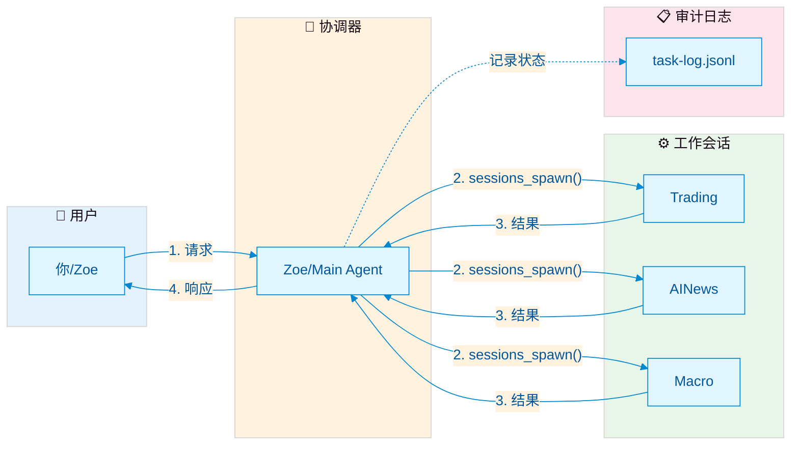

# OpenClaw 多智能体协作框架

> 一套经过生产环境验证的多智能体协作协议和架构。解决 ACP 通信不可靠、Agent 忘记注册任务、超时语义模糊等核心问题，通过零配置的插件系统实现。

[English Version](README.md)

**版本**: 2026-03-13-v9 | **许可证**: MIT | **状态**: 生产可用

---

## 一眼看懂通信模型

```
┌─────────────────────────────────────────────────────────────────────────────┐
│                         通信模型摘要（一屏看懂）                               │
├─────────────────────────────────────────────────────────────────────────────┤
│                                                                             │
│  ┌─────────┐     sessions_spawn()      ┌─────────────┐                     │
│  │  用户   │──────────────────────────▶│  工作会话   │                     │
│  │(Zoe/Main)│◀─────────────────────────│             │                     │
│  └────┬────┘     task-log.jsonl        └─────────────┘                     │
│       │                                                                     │
│       │  • 会话默认是隔离的                                                  │
│       │  • 上下文共享需要显式机制                                            │
│       │    (prompt / artifact / resume / 外部状态)                           │
│       │                                                                     │
│       ▼                                                                     │
│  ┌───────────────┐                                                          │
│  │  sessions_send │  ← 继续已有会话（不是新建）                              │
│  └───────────────┘                                                          │
│                                                                             │
│  核心规则: Agent ≠ Session ≠ Thread                                         │
│  • Agent: 配置的 AI 实体 (trading/ainews/macro)                             │
│  • Session: 隔离的执行上下文 (spawn = 全新开始)                             │
│  • Thread: UI 容器（视觉层面，不是记忆）                                     │
│                                                                             │
└─────────────────────────────────────────────────────────────────────────────┘
```

**一句话总结**: 本框架为 OpenClaw Agent 提供任务路由、隔离和完成追踪 —— 不是共享内存系统，也不是群聊模拟器。

---

## 问题是什么？

在 OpenClaw 中运行多个 AI 智能体时，你会很快遇到以下根本性问题：

### 1. 没有完成通知

你调用 `sessions_spawn` 启动一个 ACP 子 Agent。它在后台运行。然后……什么都没有。OpenClaw 不会告诉你它什么时候完成。没有回调，没有 webhook，没有事件，没有任何通知。

**根因**: OpenClaw Bug [#40272](https://github.com/openclaw/openclaw/issues/40272) — ACP 的 `notifyChannel` 参数被接受但被静默忽略。

### 2. Agent 注册遗忘症

你仔细编写文档："调用 `sessions_spawn` 前，必须先向监控系统注册任务。"LLM 读了。理解了。然后还是直接调用 `sessions_spawn`，跳过了注册。每一次都这样。

LLM 有"肌肉记忆"——它们默认使用原生工具调用，跳过包装函数。基于文档的约束对强制行为无效。

### 3. 僵尸会话

完成的 ACP 会话不会被 OpenClaw Gateway 正确清理（Bug [#34054](https://github.com/openclaw/openclaw/issues/34054)）。这些僵尸会话悄悄堆积，直到达到 `maxConcurrentSessions` 限制（默认 6），此时所有新 ACP 任务都会失败并报一个晦涩的"max sessions exceeded"错误——即使 Agent 发誓一切都已关闭。

### 4. 超时语义模糊

`sessions_send` 返回 "timeout"。但这意味着什么？
- 任务失败了？→ 也许
- 任务还在运行？→ 也许
- 消息根本没发送出去？→ 也可能
- 任务完成了但响应太慢？→ 有可能

你根本无法判断。没有后续机制，没有状态查询，没有重试协议。

### 5. 没有审计日志

一天的多 Agent 编排后，你问："今天启动了哪些任务？哪些完成了？哪些失败了？耗时多久？"答案是：翻阅 50KB 的聊天历史，手动拼凑信息。

---

## 解决方案：四层完成检测链路

**核心洞察**: 如果某个行为是强制性的，它应该是系统约束——而不是文档约束。

我们不再教 Agent 记住额外步骤（这永远会失败），而是在系统层面使用 OpenClaw 的插件 Hook 进行拦截（这永远有效）。

### 四层完成检测架构

我们的完成检测采用**四层防御架构**，处理不同类型的任务和边界情况：

```
┌─────────────────────────────────────────────────────────────────────────────┐
│                    完成检测链路 v2.5 (COMPLETION PIPELINE)                   │
├─────────────────────────────────────────────────────────────────────────────┤
│                                                                             │
│  第一层：原生事件流 (OpenClaw)                                               │
│  ┌─────────────────────────────────────────────────────────────────────┐   │
│  │  sessions_spawn(runtime="acp", streamTo="parent")                  │   │
│  │  • 接收 progress、stall、resumed 事件                              │   │
│  │  • 通过 stream 实时状态更新                                         │   │
│  │  • 覆盖：使用 streamTo 的 runtime=acp                              │   │
│  └─────────────────────────────────────────────────────────────────────┘   │
│                              ↓                                              │
│  第二层：启动登记层 (spawn-interceptor)                                      │
│  ┌─────────────────────────────────────────────────────────────────────┐   │
│  │  before_tool_call hook 拦截 sessions_spawn                          │   │
│  │  • 记录任务到 task-log.jsonl (spawning 状态)                       │   │
│  │  • 存储到 pendingTasks Map                                          │   │
│  │  • 不是完成真值——仅负责启动登记                                     │   │
│  └─────────────────────────────────────────────────────────────────────┘   │
│                              ↓                                              │
│  第三层：基础终态层 (Poller + Reaper)                                        │
│  ┌─────────────────────────────────────────────────────────────────────┐   │
│  │  L3a: ACP Session Poller (~15秒轮询)                               │   │
│  │       轮询 ~/.acpx/sessions/ 查找已关闭会话                         │   │
│  │                                                                     │   │
│  │  L3b: Stale Reaper (30分钟安全网)                                  │   │
│  │       将长期 pending 的任务标记为 timeout                           │   │
│  └─────────────────────────────────────────────────────────────────────┘   │
│                              ↓                                              │
│  第四层：终态纠偏层 (content-aware-completer)                                │
│  ┌─────────────────────────────────────────────────────────────────────┐   │
│  │  解决"Registered=False, Terminal=False"（第4类任务）问题           │   │
│  │  • 第一层：需要同时满足会话关闭 + 内容证据                          │   │
│  │  • 拒绝历史文件、空文件                                             │   │
│  │  • 幂等写入、UTC 时区安全                                           │   │
│  └─────────────────────────────────────────────────────────────────────┘   │
│                              ↓                                              │
│                    统一出口：task-log.jsonl                                   │
└─────────────────────────────────────────────────────────────────────────────┘
```

### 关键澄清

| 误解 | 真值 |
|------|------|
| "Hook 就是完成真值" | Hook 只登记任务**启动**。完成需要第3/4层。 |
| "中间状态来自 hook" | 中间状态来自第1层原生事件流，不是 hook。 |
| "Plugin 自动闭环" | Plugin 提供追踪能力。content-aware completer 验证完成。 |

---

## 通信模型与会话边界

理解 Agent 如何通信对于正确使用本框架至关重要。

### 核心概念：Agent ≠ Session ≠ Thread

| 概念 | 是什么 | 不是什么 |
|------|--------|----------|
| **Agent** | 配置了系统提示和能力的 AI 实体 | 运行中的进程或对话实例 |
| **Session** | 具有隔离状态和历史记录的单一执行上下文 | 不会自动与其他会话共享 |
| **Thread** | UI/对话容器（视觉表面） | 不是记忆存储或共享状态 |

### 默认通信流程



**ASCII 版本（用于不支持 Mermaid 的渲染器）：**

```
┌─────────┐     ┌──────────────┐     ┌─────────────────────┐     ┌──────────────┐     ┌─────────┐
│  用户   │────▶│  协调器      │────▶│   工作会话(s)       │────▶│   协调器     │────▶│  用户   │
│ (你)    │◀────│  (Zoe/Main)  │◀────│  (trading/ainews/   │◀────│  (Zoe/Main)  │◀────│ (你)    │
└─────────┘     └──────────────┘     │    macro/...)        │     └──────────────┘     └─────────┘
                                      └─────────────────────┘
                                              │
                                              ▼
                                      ┌───────────────┐
                                      │   task-log    │
                                      │  (持久化审计  │
                                      │    日志)      │
                                      └───────────────┘
```

**关键点：**
- **协调器**（通常是 Zoe/main agent）是唯一的任务调度者
- 工作会话被派生来处理特定任务
- 结果通过协调器流回，而不是直接返回给用户
- 每个会话默认具有隔离的记忆

### `sessions_send` vs `sessions_spawn`

| 函数 | 用途 | 何时使用 |
|------|------|----------|
| `sessions_spawn` | 创建具有全新上下文的**新会话** | 启动新任务或工作流 |
| `sessions_send` | 向**已有会话**发送消息 | 继续多轮对话 |

**重要说明：**
- `sessions_spawn` 创建一个没有先前历史记录的全新隔离会话
- `sessions_send` 要求会话已存在（由先前的 `sessions_spawn` 创建）
- 两个函数都使用 `sessionKey` 来标识目标

### 上下文共享模型

**默认：会话是隔离的**

```
Session A                    Session B
┌─────────┐                 ┌─────────┐
│ 历史记录 │◀───── 无 ─────▶│ 历史记录 │
│ 状态     │    共享       │ 状态     │
└─────────┘                └─────────┘
```

**共享需要显式机制：**

| 机制 | 工作原理 | 使用场景 |
|------|----------|----------|
| **Prompt 注入** | 在 prompt 参数中传递上下文 | 一次性上下文传递 |
| **Artifacts** | 写入/读取共享文件 | 持久化数据交换 |
| **Resume** | 使用 `resume` 参数继续 | 长时间运行的工作流 |
| **外部状态** | 数据库、JSON 文件等 | 跨会话持久化 |

### 本框架解决什么（和不解决什么）

| 解决的问题 | 如何解决的 | 它不是什么 |
|------------|------------|------------|
| **任务路由** | 协调器分派给适当的工作会话 | 不是自动负载均衡 |
| **隔离性** | 每个会话独立运行 | 不是共享内存系统 |
| **状态追踪** | task-log.jsonl 记录所有状态转换 | 不是群聊模拟器 |
| **结果回收** | 四层完成链路确保不丢结果 | 不是自动重试 |

### 常见误解

| 误解 | 真相 |
|------|------|
| "所有 Agent 自动共享记忆" | **错误。** 会话默认隔离。共享需要显式的 prompt/artifact/resume。 |
| "UI thread = 共享记忆" | **错误。** UI thread/channel 是视觉容器，不是记忆。状态是按会话的。 |
| "sessions_send 发给同一个人" | **错误。** 它发给同一个会话，该会话除非被 resume，否则没有先前会话的记忆。 |
| "这是一个群聊框架" | **错误。** 它是任务路由和隔离，不是社交模拟。 |
| "spawn 意味着创建新 Agent" | **错误。** 它创建一个新会话，使用现有的 Agent 配置。 |

### 实际示例

```python
# Zoe（协调器）派生一个交易分析任务
sessions_spawn(
    sessionKey="agent:trading:daily-analysis",  # 唯一会话 ID
    agentId="trading",                           # 使用哪个 Agent 配置
    prompt="分析今天的 BTC 价格走势",            # 显式传递上下文
    mode="run",
    streamTo="parent",                           # 启用第1层事件流
)

# 之后，Zoe 通过 task-log 检查结果，而不是假设共享记忆
# 交易会话不会自动知道宏观会话做了什么
# 除非 Zoe 显式通过 prompt 或 artifact 传递该上下文
```

---

## 定位：为什么选择这个方案

### 本框架是什么

这是一个基于 OpenClaw 原生 sessions/threads 构建的**轻量级协调层**，通过共享文件/artifacts 实现跨会话通信。它解决具体、实际的问题：

1. **完成检测** —— OpenClaw 不通知时（Bug #40272）
2. **任务注册** —— Agent 无法忘记（通过插件 hook）
3. **状态追踪** —— 跨隔离会话（通过 task-log.jsonl）
4. **僵尸会话清理** —— （Bug #34054 的 workaround）

### 设计理念：适配当前规模

对于**小团队运行少量 Agent**（例如：交易 + AI 新闻 + 宏观分析），本方案优先考虑：

| 原则 | 我们如何应用 |
|------|-------------|
| **信任 + 上下文** | Zoe 作为协调器的人工监督；上下文显式传递 |
| **点对点路由** | 协调器按 ID 分派给特定工作会话 |
| **显式交接** | 每次 spawn 都是故意的；无自动广播或订阅 |
| **共享 Artifacts** | `shared-context/` 中的文件充当"共享内存" |
| **人工监督** | Zoe（主 Agent）审查并决定；非完全自主 |

这是**有意为之的选择**，而非对主流框架无知。

---

## 我们从主流框架借鉴了什么

我们研究了现有解决方案并吸收了它们的洞见，同时保持轻量：

### Microsoft AutoGen Core
**参考模式:** Topic/subscription、直接消息 + 广播、handoffs、并发 Agent

**我们采用的:**
- **协调器**协调多个专业 Agent 的概念
- 显式**交接模式**（Zoe 决定哪个 Agent 处理什么）

**为什么我们不同:**
- AutoGen Core 提供具有广播能力的**运行时级消息总线**
- 我们使用通过 `sessions_spawn` 的**点对点路由** —— 对我们的规模更简单，无需广播

### LangGraph
**参考模式:** 底层编排、持久化执行、人工介入、综合记忆

**我们采用的:**
- **持久层**（task-log.jsonl 作为持久状态）
- **显式状态管理**而非隐式记忆
- 认识到**工作流需要结构**，而不仅是提示词

**为什么我们不同:**
- LangGraph 提供具有循环、条件和检查点的**基于图的工作流定义**
- 我们使用**线性协调器模式** —— 满足当前任务路由需求

### CrewAI
**参考模式:** Crews + Flows、基于角色的协作、事件驱动工作流、任务间状态管理

**我们采用的:**
- **基于角色的 Agent 定义**（交易 Agent、新闻 Agent、宏观 Agent）
- 从协调器到工作器的**任务委托**
- 通过 Artifacts/文件在任务间**共享状态**

**为什么我们不同:**
- CrewAI 提供具有内置协作模式的**高级抽象**（Flows、Crews）
- 我们使用**底层 OpenClaw 原语**（sessions_spawn、sessions_send）—— 更多控制，更少魔法

### 我们的诚实评估

| 框架 | 优势 | 为什么暂时不用 |
|------|------|---------------|
| AutoGen Core | 成熟的消息路由、广播 | 在 3-4 个 Agent 规模增加不必要的复杂性 |
| LangGraph | 持久化工作流、图结构 | 对于线性任务分派过度设计；需要 OpenClaw 集成层 |
| CrewAI | 高级协作模式 | 抽象隐藏了我们需要 workaround 的 OpenClaw 行为 |

**我们尊重这些框架**，随着需求增长可能会向它们的模式演进。

---

## 何时演进超越本设计

这种轻量级方法适用于**小团队、少量 Agent 和显式编排**。当出现以下情况时，考虑迁移到更重的框架：

### 演进触发条件

| 当前限制 | 未来需求 | 候选模式 |
|---------|---------|---------|
| 3-4 个 Agent，点对点 | 10+ Agent，动态发现 | Topic/subscription（AutoGen 风格） |
| 单一协调器 | 多协调器需要同步 | 广播总线或事件代理 |
| 显式 spawn/send | 自动工作流恢复 | 持久化工作流引擎（LangGraph 风格） |
| 基于文件的 Artifacts | 带事务的丰富共享状态 | 综合记忆层 |
| 线性任务链 | 复杂分支/合并 | 基于图的编排 |
| Zoe 审查所有内容 | 需要完全自主 | 减少人工介入 |

### 迁移路径

如果你达到这些限制：

1. **评估 AutoGen Core** 用于消息路由和广播需求
2. **评估 LangGraph** 用于持久化、复杂工作流
3. **考虑混合方案**: 保留本框架用于 OpenClaw 特定 workaround，添加框架用于编排

### 我们的承诺

本框架将保持**对其范围的诚实**：
- 不是完整 Agent 运行时的替代品
- 不是广播总线或消息代理
- 不是具有循环和条件的工作流引擎

**它是**: 一个实用层，让小规模的 OpenClaw 多 Agent 能力变得可靠。

---

### spawn-interceptor 插件 (v2.4)

一个 OpenClaw 插件（约 250 行 JavaScript），功能如下：

1. **自动拦截** 每次 `sessions_spawn` 调用（通过 `before_tool_call` hook）
2. **记录任务** 到 `task-log.jsonl`，状态为 `spawning`
3. **提供基础** 用于完成检测（第2层）

零配置。零 Agent 侧改动。Agent 甚至不知道它的存在。

### 架构

```
Agent 调用 sessions_spawn()
         │
         ▼
┌─────────────────────────────────────────────────┐
│             spawn-interceptor v2.4              │
│          (OpenClaw 插件, ~250 行)               │
├─────────────────────────────────────────────────┤
│                                                 │
│  ┌─ before_tool_call hook ──────────────────┐   │
│  │  • 检测 sessions_spawn 调用              │   │
│  │  • 提取任务元数据（agent, runtime）      │   │
│  │  • 写入 task-log.jsonl (spawning)        │   │
│  │  • 存储到 pendingTasks Map               │   │
│  └──────────────────────────────────────────┘   │
│                                                 │
│  ┌─ 完成检测 (四层架构) ────────────────────┐   │
│  │                                          │   │
│  │  L1: 原生事件流                          │   │
│  │      streamTo="parent" 进度事件         │   │
│  │                                          │   │
│  │  L2: 启动登记层 (hook)                   │   │
│  │      记录 spawning 状态                  │   │
│  │                                          │   │
│  │  L3: 基础终态层                          │   │
│  │      • ACP Session Poller (~15秒)        │   │
│  │      • Stale Reaper (30分钟)             │   │
│  │                                          │   │
│  │  L4: 终态纠偏层                          │   │
│  │      content-aware-completer.py          │   │
│  │      需要内容证据                        │   │
│  │                                          │   │
│  └──────────────────────────────────────────┘   │
│                                                 │
│  → 更新 task-log.jsonl (completed/failed)       │
│  → 持久化 pendingTasks 到 .pending-tasks.json   │
└─────────────────────────────────────────────────┘
         │
         ▼
┌─────────────────────────────────────────────────┐
│              task-log.jsonl                     │
│       (所有事件的单一事实来源)                   │
├─────────────────────────────────────────────────┤
│ 写入者:                                         │
│   • spawn-interceptor (第2层)                   │
│   • content-aware-completer (第4层)             │
│   • completion-listener (通知)                  │
│                                                 │
│ 消费者:                                         │
│   • 任意 JSONL 读取器                           │
└─────────────────────────────────────────────────┘
```

### content-aware-completer（第4层）

解决**第4类任务问题**（已注册但非终态的任务）：

| 层级 | 所需证据 | 操作 | 置信度 |
|------|---------|------|--------|
| 第一层 | 会话关闭 + 内容证据 | 标记完成 | 高 |
| 第二层 | 会话关闭，无内容 | 保持 pending | 中 |
| 第三层 | 有内容，会话未关闭 | 保持 pending | 低 |
| 第四层 | 无证据 | 保持 pending | 低 |

**核心规则**：
- **强证据要求**：同时满足会话关闭 AND 内容证据
- **历史文件拒绝**：防止基于旧文件标记任务完成
- **空文件拒绝**：忽略零字节输出
- **幂等写入**：多次运行安全
- **UTC 时区安全**：所有时间戳使用 UTC

---

## 快速开始

### 前置条件

- OpenClaw >= 2026.3.x（需要 `before_tool_call` 插件 hook 支持）
- Python 3.10+（用于 completion-listener 和 content-aware-completer）
- 至少配置 1 个 agent

### 1. 安装插件

```bash
cp -r plugins/spawn-interceptor ~/.openclaw/extensions/
```

### 2. 重启 Gateway

```bash
# macOS
launchctl kickstart -k gui/$(id -u)/ai.openclaw.gateway

# Linux
systemctl --user restart openclaw-gateway
```

### 3. 验证

```bash
# 触发一个 ACP 任务，然后检查日志：
tail -f ~/.openclaw/shared-context/monitor-tasks/task-log.jsonl
```

你应该看到如下条目：

```json
{
  "taskId": "tsk_20260313_abc123",
  "agentId": "main",
  "runtime": "acp",
  "status": "spawning",
  "spawnedAt": "2026-03-13T01:30:00.000Z"
}
```

### 4.（可选）设置 content-aware-completer

```bash
# 持续运行第4层终态纠偏
python3 examples/content-aware-completer/content_aware_completer.py --loop --interval 30

# 或运行一次
python3 examples/content-aware-completer/content_aware_completer.py --once
```

**推荐模式**：编码/文档任务使用 `mode="run"`。仅复杂多轮任务使用 `mode="session"` 或 `mode="thread"`。

完整部署指南见 [QUICKSTART.md](QUICKSTART.md)。

---

## 已知 OpenClaw Bug

这个框架的存在部分原因是 OpenClaw 中以下未解决的 bug：

| Issue | 描述 | 影响 | 我们的 Workaround |
|-------|------|------|-------------------|
| [#34054](https://github.com/openclaw/openclaw/issues/34054) | Gateway 不对已完成的 oneshot 会话调用 `runtime.close()` | 僵尸会话触达 `maxConcurrentSessions` 限制 | Guardian 脚本每日 GC |
| [#35886](https://github.com/openclaw/openclaw/issues/35886) | ACP 子进程在 TTL 后未被清理 | 僵尸进程堆积 | Guardian 健康检查自动重启 |
| [#40272](https://github.com/openclaw/openclaw/issues/40272) | ACP 的 `notifyChannel` 不生效 | 无原生完成通知 | 四层完成检测链路 |
| （未文档化） | `subagent_ended` hook 不对 ACP runtime 触发 | ACP 任务状态永远停留在 `spawning` | ACP Session Poller（第3层） |

---

## Agent 默认模板

启动 ACP Agent 时，使用此最简模板：

```python
# 默认版本（编码/文档任务）
sessions_spawn(
    sessionKey=f"agent:{agent_id}:task",
    agentId=agent_id,
    prompt="你的任务",
    mode="run",  # 推荐用于大多数任务
    streamTo="parent",  # 启用第1层事件流
)
```

复杂多轮任务：

```python
# 扩展版本（仅用于复杂多轮任务）
sessions_spawn(
    sessionKey=f"agent:{agent_id}:task",
    agentId=agent_id,
    prompt="你的复杂任务",
    mode="session",  # 仅用于复杂多轮
    streamTo="parent",
)
```

---

## 文档导航

| 文档 | 用途 |
|------|------|
| [DOCS_MAP.md](DOCS_MAP.md) | **从这里开始** —— 新读者推荐阅读顺序指南 |
| [COMMUNICATION_ISSUES.md](COMMUNICATION_ISSUES.md) | 问题分析和设计原理（README 之后首选阅读） |
| [ARCHITECTURE.md](ARCHITECTURE.md) | 架构深度解析，含数据流图 |
| [AGENT_PROTOCOL.md](AGENT_PROTOCOL.md) | 完整的协作协议规范 |
| [ROUNDTABLE_PROTOCOL.md](ROUNDTABLE_PROTOCOL.md) | 多 Agent 圆桌讨论共享频道规则 |
| [COMPLETION_TRUTH_MATRIX.md](COMPLETION_TRUTH_MATRIX.md) | 运行时完成真值来源和降级路径 |
| [CAPABILITY_LAYERS.md](CAPABILITY_LAYERS.md) | L1（OpenClaw 原生）/ L2（框架增强）/ L3（需要核心修改） |
| [CONTENT_AWARE_COMPLETER.md](CONTENT_AWARE_COMPLETER.md) | 第4层完成验证文档 |
| [QUICKSTART.md](QUICKSTART.md) | 详细部署指南 |
| [GETTING_STARTED.md](GETTING_STARTED.md) | 新用户引导 |
| [ANTIPATTERNS.md](ANTIPATTERNS.md) | 踩坑经验和教训 |
| [INTERNAL_VS_OSS.md](INTERNAL_VS_OSS.md) | 开源版与内部版差异说明 |
| [RELEASE_NOTES.md](RELEASE_NOTES.md) | 版本历史 |

---

## 仓库结构

```
├── plugins/
│   └── spawn-interceptor/        # OpenClaw 插件 (~250 行)
│       ├── index.js              # v2.4: hooks + 完成链路
│       ├── package.json          # 插件元数据
│       └── openclaw.plugin.json  # OpenClaw 插件清单
├── examples/
│   ├── completion-relay/         # 基础完成监听器
│   │   ├── completion_listener.py
│   │   └── tests/
│   ├── content-aware-completer/  # 第4层完成验证
│   │   ├── content_aware_completer.py
│   │   └── tests/
│   ├── l2_capabilities.py        # L2 能力实现演示
│   └── protocol_messages.py      # 协议消息格式演示
├── COMMUNICATION_ISSUES.md       # 核心设计文档
├── ARCHITECTURE.md               # 架构深度解析
├── AGENT_PROTOCOL.md             # 协作协议
├── CONTENT_AWARE_COMPLETER.md    # 第4层文档
├── INTERNAL_VS_OSS.md            # 开源版范围说明
├── RELEASE_NOTES.md              # 版本历史
└── README_CN.md                  # 中文 README
```

---

## 设计理念

| 维度 | 传统方式 | 我们的方式 |
|------|----------|-----------|
| 任务注册 | Agent 需记住调用包装函数 | 插件 hook 自动拦截（第2层） |
| 完成检测 | 单点故障 | 四层防御链路 |
| 中间状态 | 不追踪 | 原生事件流（第1层） |
| 终态验证 | 会话关闭 = 完成 | 需要内容证据（第4层） |
| 状态管理 | 纯内存（重启即丢失） | 持久化到 JSONL + pending 文件 |
| 监控 | 每个组件各自一个文件 | 统一的 task-log.jsonl |
| 错误处理 | 静默失败 | DLQ + Stale Reaper + 内容验证 |

---

## 贡献

欢迎 PR 和 Issue。贡献指南见 [CONTRIBUTING.md](CONTRIBUTING.md)。

## 许可证

MIT 许可证
